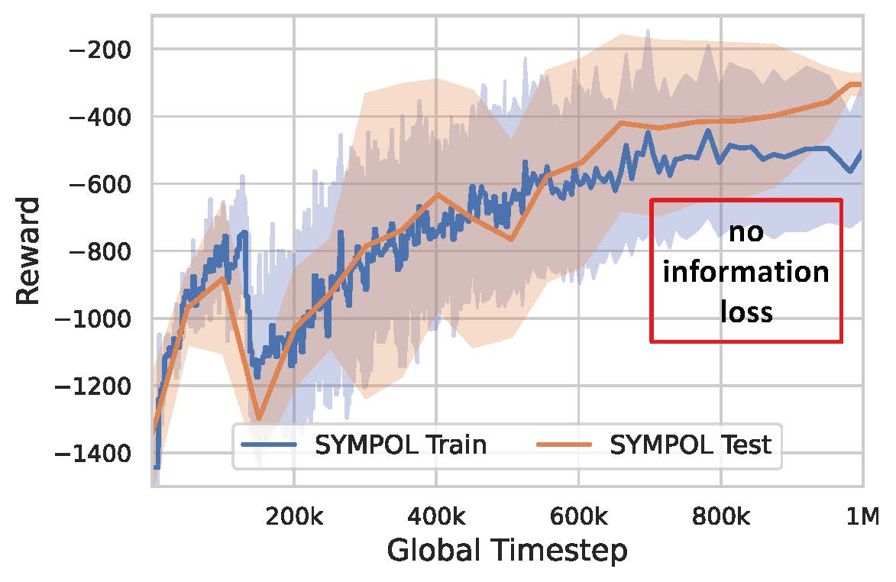
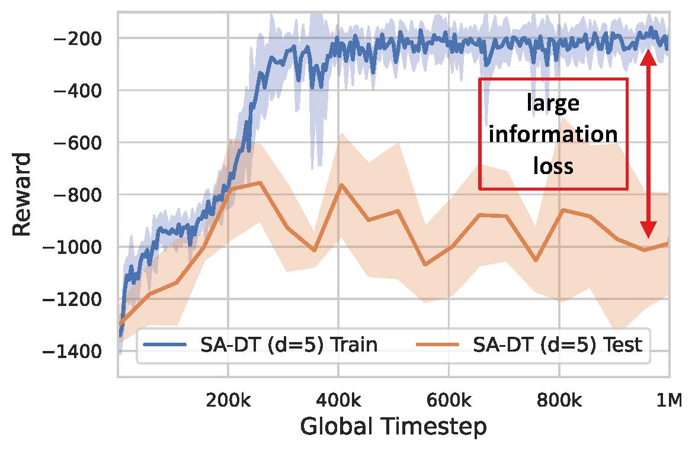
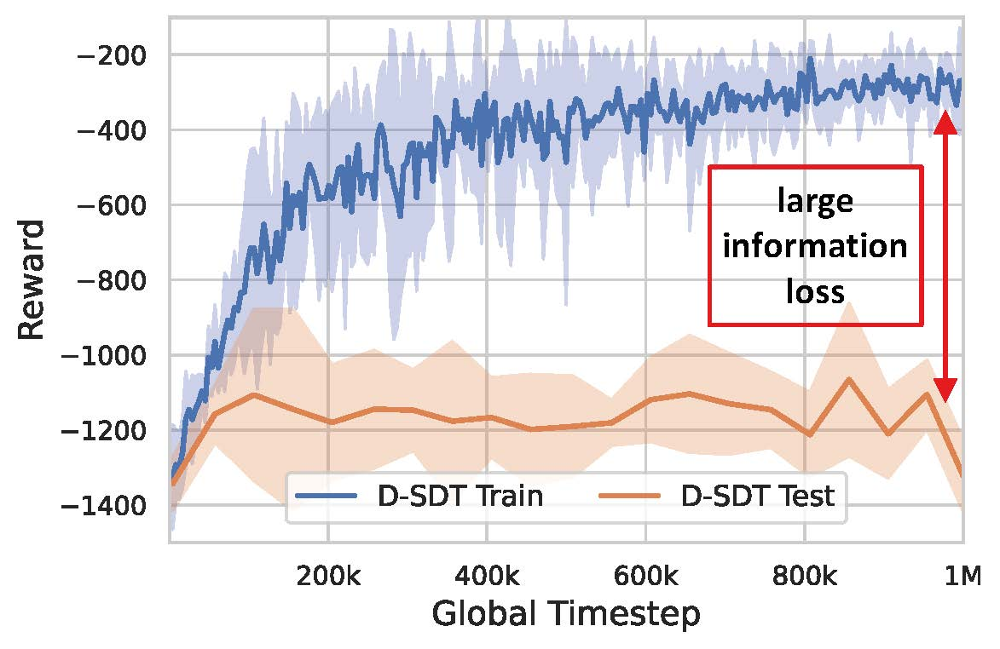
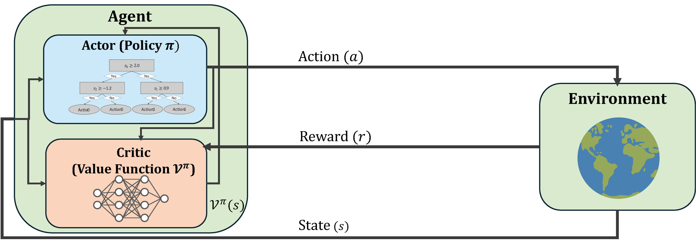

# 🤖🌳 SYMPOL: Symbolic Tree-Based On-Policy Reinforcement Learning 🌳🤖

[](https://arxiv.org/abs/2408.08761)

<div align="center">

<table>
  <tr>
    <td>
      
      <p align="center"><strong>Figure 1 (a):</strong> SYMPOL (ours)</p>
    </td>
    <td>
      
      <p align="center"><strong>Figure 1 (b):</strong> State-Action DT</p>
    </td>
    <td>
      
      <p align="center"><strong>Figure 1 (c):</strong> Discretized Soft DT</p>
    </td>
  </tr>
</table>

<p><strong>Information Loss in Tree-Based Reinforcement Learning on Pendulum.</strong> Existing methods for symbolic, tree-based RL (see Figure 1 (b) and (c)) suffer from severe information loss when converting the differentiable policy (high train reward) into the symbolic policy (low test reward). Using SYMPOL (Figure 1 (a)), we can directly optimize the symbolic policy with PPO and therefore have no information loss during the application (high train and test reward).</p>
</div>

### Why SYMPOL?
🔍 **It’s a novel method to learn interpretable decision trees directly with policy gradients, allowing a seamless integration into existing RL frameworks.**

<div align="center">



<p><strong>Figure 2: SYMPOL.</strong> This is an overview of SYMPOL, with its two main components: (1) an interpretable DT policy and (2) a neural network as critic, which can be integrated into arbitrary actor-critic RL frameworks.</p>

</div>

### Key Innovations:
✅ Efficient learning of axis-aligned decision trees on-policy  
✅ Enhanced training stability through a dynamic rollout buffer and batch size  
✅ Weight decay to support dynamic adjustment of tree architecture  
✅ Separate actor-critic network architecture, where the critic captures complexity, and the actor ensures interpretability  

### Why is SYMPOL different?
✔️ No need for pre-trained neural networks  
✔️ No complex custom search procedures  
✔️ No post-processing  
✔️ No information loss  

➡️ **SYMPOL guarantees that the learned policy remains consistent from training to inference.**

### Performance? 
🚀 **SYMPOL outperforms existing tree-based RL approaches and provides human-understandable explanations for every decision made.**

### Curious to explore more? 
📝 Read our detailed preprint on arXiv: [https://arxiv.org/abs/2408.08761](https://arxiv.org/abs/2408.08761)

💬 We’d love to hear your thoughts—feedback is always welcome!  
You can contact me at [sascha.marton@uni-mannheim.de](mailto:sascha.marton@uni-mannheim.de)

### Cite us
```
@article{marton2024sympol,
  title={SYMPOL: Symbolic Tree-Based On-Policy Reinforcement Learning},
  author={Marton, Sascha and Grams, Tim and Vogt, Florian and L{\"u}dtke, Stefan and Bartelt, Christian and Stuckenschmidt, Heiner},
  journal={arXiv preprint arXiv:2408.08761},
  year={2024}
}
```

## Implemenation and Experiments

### Installing Requirements

Create a virtual environment with any tool of your choice, e.g. conda and activate it:

```bash
conda create -n sympol python=3.11.4
conda activate sympol
```

To install all necessary libraries, run

```bash
pip install -r requirements.txt
```

If you do not have matching cuda distributions for JAX, this might significantly slow down compilation. In this case, please consider updatind cuda, e.g. with

```bash
conda install cuda=12.6 -c nvidia
```
 

### Running the Script

First, choose the environment you want to run using the --env_id argument, for example, if you want to run PPO using SYMPOL (SYMPOL is the default actor, you can choose between actors using the --actor flag, see `args.py` for more info) on CartPole-v1 using the default hyperparameters (specified as default in `args.py`)

```bash
python ppo.py --env_id CartPole-v1
```

If an already optimized config exists (please check `configs.py` if a dictionary exists, which name contains the environment you want to run), you can use

```bash
python ppo.py --env_id CartPole-v1 --use_best_config
```

For further possible arguments check the `args.py` file.

We want to note that our code is based on ClearnRL (https://github.com/vwxyzjn/cleanrl) with adjustments to our method described in the paper as well as gymnax. We provide two scripts, `ppo.py` for standard Gymnasium environments and `ppo_gymnax.py` for vectorized environments with gymnax (https://github.com/RobertTLange/gymnax).


### Experiments
To reproduce the experiments conducted to obtain the results in the paper, we provide the file `commands_to_run.txt` which contains all the exact commands used to obtain the results from the paper (with HPO as well as using the already documented optimized hyperparameters). We logged all results using wandb which can be activated using the `--track` flag.


### Randomness

To avoid randomness, we used a predefined seed for all experiments. Unfortunately, due to the inherent randomness of some GPU operations we were not able to completely remove randomness. Therefore, running the experiments might result in slightly different results from those presented in the paper. However, this should only be minor deviations and the results and claims should stay consistent with those reported in the paper.

### Hyperparameter Optimization with Optuna

With JAX, we can actually optimize the hyperparameters quite efficiently, due to the significant speed up.
If you want to optimize a range of hyperparameters, first note that the range of each hyperparameter is specified in `configs.py` in the body of the function `suggest_config`. This function is called for every optuna trial. You can remove / add hyperparameters there, or change their range. To run one optuna study for example on LunarLander, you can use

```bash
python ppo --env_id CartPole-v1 --optimize_config --track
```

I recommend using the --track flag, so each run gets logged in wandb. This will allow you to find easily the best config after the optuna study in the wandb user interface. 
However, if you decide to track your experiments using optuna, keep in mind you can only run 1 job when creating the study (see line 430)

```python
study.optimize(objective_fn, n_trials=args.n_trials, n_jobs=1)
```

If you use more than one job, wandb will try to initialize multiple times, and you will get a freeze, at least that is what happened to us. The best fix was to simply run the script multiple times. For example, if you want to run 3 jobs, you can do the following:

Open a tmux session and run:

```bash
python ppo --env_id CartPole-v1 --optimize_config --track
```

Hide the session, and open another one and run the same argument again as often as desired.
Now you are running jobs in parallel, and optuna also shares their trials' results between each job. This is also what the `hpopt.db` file is good for in the directory (if it is not there yet, it will be created as soon as optuna is run the first time). This file is created by optuna to save information about individual trials.

Alternatively, you can also use the `run_ppo.sh` script for parallelization of the HPO.

